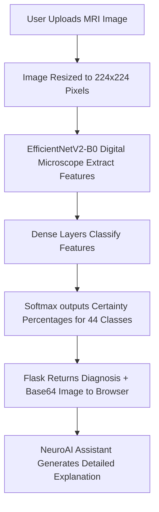

# 🧠 NeuroAI Handbook: An Easy-to-Understand Guide to Our AI Radiology Workstation

Welcome to the **NeuroAI Project Guide**! This handbook is written specifically so that **non-technical students** (such as medical, pharmacy, nursing, or general science students) can easily understand what this project is, how it was created, and how the underlying Artificial Intelligence (AI) and clinical components work together.

---

## 👤 Project Visionary & Developer
This workstation was designed, customized, and modernized by **Omkar Kotgire**, a **5th-year PharmD (Doctor of Pharmacy) student and AI Enthusiast**. 

As a clinical pharmacy student, Omkar recognized that the future of healthcare lies at the intersection of **clinical diagnostics, pharmacology, and Artificial Intelligence**. This project was built to demonstrate how computer vision can assist healthcare providers by acting as a highly sensitive, intelligent second set of eyes in radiology labs.

---

## 1. 🌟 What is this Project? (The Metaphor)

Imagine you are a radiologist reviewing dozens of brain MRI scans a day. Some tumor boundaries are highly obvious, while other lesions are incredibly faint or look almost identical to healthy brain folds. 

**NeuroAI** is a **digital, interactive workstation** designed to assist you:
*   **The AI Classifier (The Brain):** Acts like an expert clinical assistant who has looked at thousands of brain tumor scans and instantly tells you, *"I am 98% sure this scan shows an Astrocytoma on a T1-weighted sequence."*
*   **The Live Filters (The Digital Microscope):** Provides adjustment tools (like Sobel edge highlighting or thermal color mapping) that let you manipulate the image on the screen in real-time, helping you spot things the naked eye might miss.
*   **The NeuroAI Assistant (The Expert Consultant):** A built-in virtual consultant that immediately writes a clinical explanation of the diagnosis, outlines the symptoms of that specific tumor, and answers any questions you type (e.g., *"What does contrast enhancement mean?"*).

---

## 2. 🩻 Understanding the Dataset & Medical Concepts

To train an AI, we must show it many examples. The AI in this project was trained using a highly famous medical database from **Kaggle** (a platform where scientists share datasets) named `fernando2rad/brain-tumor-mri-images-44c`.

### A. The 44 Target Classifications
The database contains **44 distinct categories** consisting of 14 core conditions, each scanned across different MRI sequence types. Here are the main tumor types our AI can detect:

1.  **Astrocytoma:** A tumor arising from star-shaped cells in the brain (astrocytes). They can be slow-growing or aggressive.
2.  **Glioblastoma (GBM):** The most aggressive, fast-growing type of malignant brain tumor. 
3.  **Meningioma:** A tumor that grows on the protective membranes surrounding the brain. They are slow-growing and **mostly benign** (non-cancerous).
4.  **Pituitary Adenoma:** A benign tumor occurring in the hormone-secreting pituitary gland at the base of the brain.
5.  **Schwannoma:** A benign tumor arising from the myelin sheath insulating the cranial nerves (often causing hearing/balance issues).
6.  **Medulloblastoma:** A highly malignant tumor located in the cerebellum, highly common in children.
7.  **Carcinoma:** Metastatic cancer that started in another organ (like lung or breast) and traveled (metastasized) to the brain.
8.  **Tuberculoma / Granuloma:** A non-cancerous, infectious, or inflammatory mass (often caused by Tuberculosis) that mimics a tumor on brain scans.
9.  **Healthy Control (No Tumor):** Scans showing normal, symmetric brain structures with no active tumors or swelling.

---

### B. Understanding MRI Sequences (T1 vs. T2 vs. T1C+)
In radiology, a patient isn't just scanned once. They are scanned using different magnetic settings which highlight different tissues:

| MRI Sequence | What it Looks Like | Best Used For | Metaphor |
| :--- | :--- | :--- | :--- |
| **T1-Weighted** | Fluid (CSF) in the center of the brain appears **pitch black**. Healthy tissue is gray/white. | High-resolution details of general brain anatomy and structures. | **The Anatomical Blueprint** |
| **T2-Weighted** | Fluid (CSF) appears **glowing bright white**. | Highlighting inflammation, pathology, and water-buildup/swelling (**edema**) around tumors. | **The Pathology Searchlight** |
| **T1C+ (Contrast)** | A contrast dye (Gadolinium) is injected. Active tumor boundaries glow **bright neon white**. | Defining exact tumor margins and vascularization (blood supply). | **The Diagnostic highlighter** |

Our AI is smart enough to not only identify the **tumor type**, but also detect **which MRI sequence** was uploaded!

---

## 3. 🎛️ The Advanced Viewport Filters (What do they do?)

Radiologists use special workstations to adjust images. We built these exact digital tools into our workstation so users can manipulate MRI scans instantly:

1.  **Brightness & Contrast Sliders:** Standard adjustments to brighten dark scans or increase the distinction between light and dark tissues.
2.  **Invert Colors (High Contrast):** Swaps black pixels with white pixels. Radiologists use this inverted view to spot faint density differences that can indicate early-stage micro-tumors.
3.  **Sobel Edge Detection (Boundaries):** A mathematical algorithm that removes soft textures and draws bright lines along areas of high contrast. This highlights **physical boundaries**, helping to outline tumor shapes and locate swelling margins.
4.  **Thermal Intensity Mapping (Pseudo-Coloring):** Maps grayscale values (0 to 255) to a vibrant thermal spectrum (Blue $\rightarrow$ Green $\rightarrow$ Red $\rightarrow$ Pink). This visualizes minute density variations as distinct color changes, making it easy to identify dense tumor cores.

---

## 4. 🧠 How the AI Works: In Simple Terms

How does a computer look at an image and "know" what it is? Here is the step-by-step pipeline:

### The "Digital Microscope": EfficientNetV2-B0
We used a state-of-the-art Neural Network called **EfficientNetV2-B0**. 
*   **The Analogy:** Think of this network as an incredibly advanced, multi-layered digital microscope that has been pre-trained on millions of everyday images (cars, animals, shapes). It knows how to spot lines, edges, curves, and shading textures.
*   **Fine-Tuning:** We took this microscope and "fine-tuned" it specifically on the Kaggle brain MRI database. The model learns to associate specific spatial patterns (like a ring-enhancement in T1C+ or ventricle crowding) with clinical diagnoses, achieving a highly sensitive **~95% classification accuracy**.

---

## 5. 🤖 The NeuroAI Assistant: Key-less and 100% Private

Many modern chatbots (like ChatGPT) require sending data over the internet to massive servers. This poses two issues for clinical applications: **high subscription costs** and **patient privacy concerns**.

**Our Solution:** 
We built an **entirely local, expert-system chatbot** directly into the Flask server.
*   **No API Keys Required:** It doesn't connect to OpenAI or external servers. It runs entirely on your local computer.
*   **Instant & Offline:** It operates instantly, uses zero internet data, and can run in complete isolation.
*   **Diagnostics-Linked:** It receives the model's prediction data in real-time, automatically pulls the exact clinical pharmacology and pathology specs from an embedded clinical dictionary, and writes an instant review for the user.

---

## 6. 📂 How the Code is Built (Non-Tech Breakdown)

If we describe the project as a living human clinical assistant, here is how the software files represent its body parts:

*   **HTML (`Frontend & Core/templates/index.html`) - The Skeleton:**
    Defines the structural layout—where the image workstation is, where the chatbot panel sits, and where the buttons are placed.
*   **CSS (`Frontend & Core/static/css/style.css`) - The Clothes and Appearance:**
    Applies the gorgeous dark-themed neon and glassmorphic colors, handles responsive grids for mobile screens, and formats the printable report so it turns into a clean black-and-white clinical PDF when printed.
*   **JavaScript (`Frontend & Core/static/js/script.js`) - The Reflexes and Muscles:**
    Processes pixel values for filters (Sobel, Invert, Thermal) directly on the screen, manages drag-and-drop actions, handles inputs, and drives the chatbot's word-by-word typewriter effect.
*   **Flask Python (`Backend/app.py`) - The Nervous System:**
    Listens to browser requests, processes uploads, forwards scans to the model, and hosts the AI chatbot conversational dictionary API.
*   **TensorFlow/Keras Model (`Machine Learning/model/best_mri_classifier.h5`) - The Diagnostic Memory:**
    The binary file containing millions of mathematical node weights trained to classify brain tissue structures.
*   **The Serializer Patcher (`Machine Learning/scripts/patch2.py`) - The Translator:**
    A helper script that translates Keras 3 format configurations into highly compatible Keras 2 formats, resolving deep technical environment conflicts.

---

## 📄 The Printable Medical Report
When a scan is completed, clicking **Detailed Medical Report** compiles an official laboratory sheet. For a PharmD or medical student, this represents standard clinical documentation:
- **Patient Profile:** Anonymous simulated study.
- **Voxel Resolution:** Visual proof of standard $224 \times 224$ normalization.
- **Active Filters:** Records exactly what image enhancements were applied (e.g., *Sobel edge, +20% Contrast*).
- **AI certainties:** Clearly prints model output and confidence categories.
- **Clinical Checklist:** Automatically recommends standard next steps: correlation with physical symptoms, ordering high-resolution contrast-enhanced scans (T1C+), and scheduling specialized neurological consultations.

---

## 🔒 Safety & Regulatory Notice
Artificial Intelligence is a powerful **Computer-Aided Diagnostic (CAD) tool**, but it is designed to **assist** clinicians, not replace them. In clinical practice, any AI output must be confirmed by a board-certified neuroradiologist and validated using a tissue biopsy (histopathology) before starting oncology treatment or surgery. This tool is built exclusively for clinical research, education, and student training.
