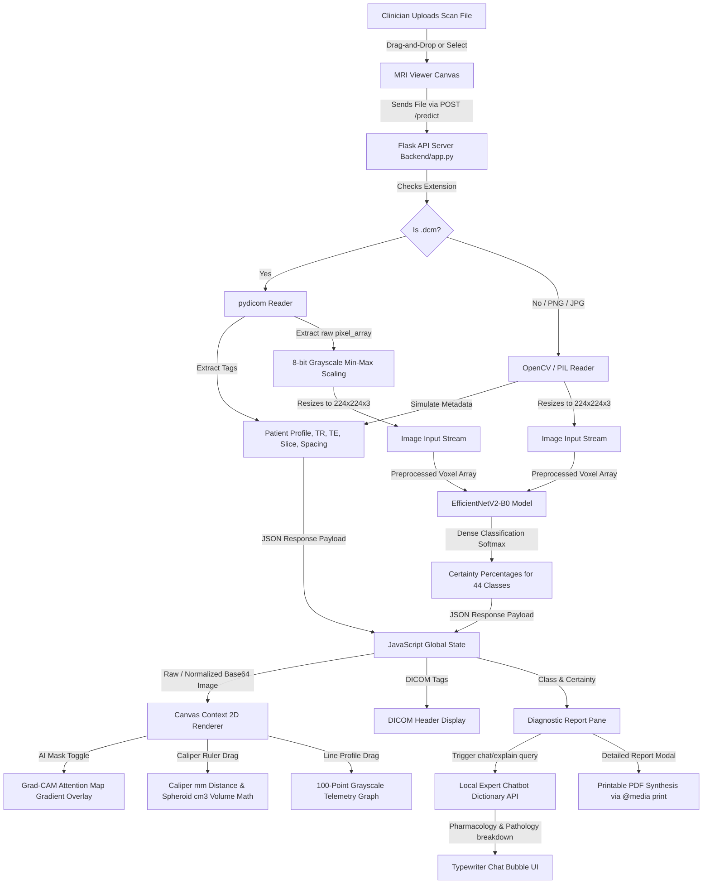

# 🧠 NeuroAI - Advanced Radiology Workstation & Brain Tumor MRI Classifier

[](https://www.python.org/)
[](https://www.tensorflow.org/)
[](https://keras.io/)
[](https://flask.palletsprojects.com/)

---

## 📖 1. What is this Project?

**NeuroAI** is a state-of-the-art, interactive **AI-powered Radiology Diagnostic Workstation & Assistant** designed for high-resolution brain tumor classification and clinical telemetry analysis. Built to bridge the gap between convolutional neural networks and real-world radiology workflows, NeuroAI provides clinicians with an all-in-one workstation for viewing scans, measuring tumor volume, analyzing voxel intensities, and generating instant diagnostic summaries.

The system is key-less, 100% private, runs entirely client-side/locally, and requires zero logins or databases. It is designed to act as a **"second set of intelligent eyes"** in clinical radiology labs, helping to reduce diagnostic error, speed up triage, and serve as an educational training ground for medical, pharmacy, and computer science students.

---

## 🏛️ 2. Detailed System Architecture & Data Flow

The end-to-end data pipeline traces how a clinician's input scan is parsed, classified, analyzed, and synthesized into a final interactive diagnostic outcome:



### End-to-End Pipeline Steps:
1. **Input Stage:** The clinician uploads a standard DICOM (`.dcm`) file or common image format (PNG/JPG) using drag-and-drop or file selection.
2. **Backend Dispatching:** JavaScript captures the file stream and routes it via a multipart HTTP `POST` request to `/predict` on the Flask server backend (`Backend/app.py`).
3. **Image Analytics & Preprocessing:** 
   - **DICOM Input:** `pydicom` parses the binary file structure to extract physical metadata tags (such as Repetition Time, Echo Time, patient characteristics, and pixel spacing). The raw high-dynamic-range (often 12-bit or 16-bit) pixel array is normalized using min-max scaling to project it into the 8-bit grayscale space ($0\text{--}255$) and converted to RGB.
   - **Standard Image Input:** OpenCV/Pillow reads the image, and simulated metadata tags are generated.
   - **Input Normalization:** The image is resized to $224 \times 224 \times 3$ pixels to meet the input requirements of the deep learning model.
4. **Machine Learning Inference:** The preprocessed pixel array is passed to the fine-tuned **EfficientNetV2-B0** convolutional neural network. The model executes forward propagation, and its final Softmax activation layer outputs a certainty probability vector across the 44 possible classes.
5. **Interactive UI Update:** The backend compiles the prediction, confidence levels, and metadata into a JSON response. JavaScript updates the application state, rendering the image onto an HTML5 Canvas, populating the DICOM header grid, and unlocking diagnostic telemetry:
   - **Grad-CAM Attention Map:** Blends a radial gradient heatmap over the detected region to show where the AI focused its attention.
   - **Caliper Ruler:** Allows drawing a line across the tumor to measure real-world physical size ($mm$) based on DICOM pixel spacing data, and instantly computes estimated spheroid volume ($cm^3$).
   - **Line Profiler:** Extracts grayscale values along the caliper path and charts them on a telemetry graph, illustrating tissue density transitions.
6. **Local Assistant Q&A:** The backend `/chat` API is queried automatically. It references an embedded medical dictionary to retrieve pathology descriptions, pharmacological protocols, and patient management next-steps, displaying them inside a typing-simulated chatbot panel.
7. **Clinical Report Export:** The user can click a button to generate an official laboratory diagnostic sheet, formatted specifically for clean black-and-white printing/PDF generation.

---

## ⚖️ 3. Importance & Target Stakeholders

### Why is this Project Important?
In neuro-oncology, diagnostic speed and accuracy are crucial. Brain tumors like glioblastomas are highly aggressive and double in volume in under three weeks, whereas non-malignant infections (like Tuberculomas) mimic tumors on scans but require standard antibiotic treatments instead of invasive brain surgery.

NeuroAI bridges this critical diagnostic gap by providing:
- **Offline Reliability:** Operates entirely locally without internet connections or API keys, allowing its deployment in rural clinics, disaster zones, or low-resource settings.
- **Improved Transparency:** Explains AI predictions with Grad-CAM visualization, converting "black box" deep learning into interpretable clinical insights.
- **Quantitative Diagnostics:** Replaces visual tumor estimation with exact spatial calculations (mm caliper measurement and $cm^3$ volume calculation).

### Target Stakeholders:
* **Radiologists & Oncologists:** Use the application as a Computer-Aided Diagnostic (CAD) second opinion to verify tumor categories and scan sequences.
* **PharmD, Medical & Nursing Students:** Study how pathological conditions present differently across T1, T2, and T1C+ (contrast) MRI sequences, and practice standard clinical reporting workflows.
* **Clinical Researchers:** Benchmarks computer-vision models in a modular, easy-to-use Radiology Workstation frontend.

---

## 📂 4. Folder Structure & Module Importance

The repository is structured into exactly 5 directories to enforce clear separation of concerns:

```
Brain-Tumor-MRI-Classifier-main/
│
├── Backend/                            # Core API routing & local expert service
│   ├── app.py                          # Flask server gateway
│   ├── chatbot.py                      # Desktop GUI clinical tool
│   └── .env                            # Local configuration and environment variables
│
├── Machine Learning/                   # Neural network weights & development tools
│   ├── model/
│   │   └── best_mri_classifier.h5      # Fine-tuned model parameters (HDF5 format)
│   └── scripts/
│       ├── train.py                    # Training & cross-validation code
│       ├── patch.py                    # Weights serializer converter v1
│       └── patch2.py                   # Weights serializer converter v2
│
├── Image Analytics/                    # Clinical documentation on pixel processing
│   └── README.md                       # OpenCV, PIL, and pydicom analytical guide
│
├── Frontend & Core/                    # Presentation and user interface layers
│   ├── templates/
│   │   └── index.html                  # Responsive HTML dashboard skeleton
│   └── static/
│       ├── css/
│       │   └── style.css               # Glassmorphic workstation design & print layout
│       └── js/
│           └── script.js               # Canvas filters, caliper math, and chat UI logic
│
└── Configs/                            # Environment, configuration, & dependencies (this folder)
    ├── requirements.txt                # List of Python dependencies
    ├── Procfile                        # Startup command configurations for Cloud services
    ├── build.sh                        # Shell script running during cloud build cycles
    ├── runtime.txt                     # Specifies target Python interpreter version
    ├── .gitignore                      # Prevents local/cache files from being tracked
    ├── data/                           # Local datasets and sample scans
    ├── docs/                           # Extended medical and system documents
    ├── temp_uploads/                   # Temporary file upload directory
    ├── .venv/                          # Python local virtual environment folder
    ├── README.md                       # Comprehensive project README (this file)
    ├── DEPLOYMENT.md                   # Cloud hosting configuration guide
    └── PROJECT_GUIDE.md                # Handbook for non-technical healthcare students
```

### Subfolder Deep-Dives:

#### 1. `Backend/`
- **Importance:** Serves as the system's central processing unit.
- **app.py:** The entry point Flask application. It defines the routing endpoints (`/`, `/predict`, `/chat`), parses multipart files, extracts DICOM tags, rescales matrices, runs the TensorFlow classifier, and serves the static assets.
- **chatbot.py:** A desktop Tkinter GUI application used to test the diagnostic chatbot dictionary offline.
- **.env:** A local configuration file containing development variables, port configurations, and secret keys. Keeping it here keeps configuration isolated from the frontend templates.

#### 2. `Machine Learning/`
- **Importance:** Houses the model intelligence and training scripts.
- **model/best_mri_classifier.h5:** The saved neural network containing the fine-tuned weights and layer configuration.
- **scripts/train.py:** The training pipeline script, outlining dataset augmentation, learning rate scheduling, model compilation, and metric recording.
- **scripts/patch.py & patch2.py:** Utility scripts that modify Keras 3 metadata tags inside `.h5` files, translating them to older Keras 2 serialization standards to guarantee cross-environment model loading.

#### 3. `Image Analytics/`
- **Importance:** Organizes the image processing documentation.
- **README.md:** Details the pixel-processing math (min-max scaling, spatial distances, array reshaping) used to clean MRI scans before inference.

#### 4. `Frontend & Core/`
- **Importance:** Manages the presentation layer and user interactions.
- **templates/index.html:** The webpage structure.
- **static/css/style.css:** Provides the dark glassmorphic UI styling. It also contains media queries (`@media print`) that format the printable diagnostic reports.
- **static/js/script.js:** Implements client-side Canvas operations (contrast, brightness, Sobel filters, thermal mapping) and clinical tools (calipers, line profiler, typewriter effects).

#### 5. `Configurations & Dependencies (Configs/)`
- **Importance:** Houses environment files, databases, deployment specifications, and user guides.
- **requirements.txt:** Lists all Python packages and specific versions required to compile and run the project safely.
- **Procfile:** Tells production platforms (like Heroku) how to start the app server process (e.g., `web: gunicorn --chdir Backend app:app`).
- **build.sh:** Shell script that automates package installation and compilation tasks during cloud builds.
- **runtime.txt:** Declares the exact Python version (`python-3.10.12`) to enforce environment parity on cloud platforms.
- **.gitignore:** Prevents system-specific files, package cache, and large binaries (like `.venv/` or upload caches) from cluttering repository revisions.
- **data/:** Contains sample medical image folders and testing presets.
- **docs/:** Houses auxiliary documentation, sample reports, and clinical references.
- **temp_uploads/:** A local server storage directory where files are placed temporarily during processing.
- **.venv/:** The local virtual environment directory that holds all isolated Python libraries and compiler binaries.
- **README.md (this file), DEPLOYMENT.md, and PROJECT_GUIDE.md:** Markdown guides detailing project operations, deployment settings, and simplified medical descriptions.

---

## 🛠️ 5. Tech Stack & Deep-Dive Dependency Breakdown

### Core Tech Stack
* **Backend Framework:** Flask 2.3.3 (running on Python 3.10)
* **Production Web Server:** Gunicorn 21.2.0
* **Deep Learning Engine:** TensorFlow 2.17.0 (with Keras 3.12.2 API)
* **Image Processing Engine:** OpenCV (4.8.1.78), Pillow (10.0.0), pydicom (2.4.3)
* **Frontend Languages:** HTML5, CSS3 (Vanilla CSS with Custom Glassmorphism variables), ES6+ JavaScript

---

### Detailed Dependency Profiles

#### 1. TensorFlow & Keras
- **TensorFlow** is Google's open-source machine learning platform. It manages tensors, builds computation graphs, and compiles underlying matrix multiplication routines.
- **Keras** is the high-level neural network API running on top of TensorFlow. In this project:
  - We load the **EfficientNetV2-B0** pre-trained convolutional neural network (CNN) backbone.
  - We fine-tune it by freezing the base convolutional layers (which are already trained to recognize universal shapes, edges, and textures) and append custom clinical layers: a Flatten layer, a Dropout layer ($0.3$) to prevent overfitting, and a final Dense classification layer with a **Softmax** activation function.
  - During server startup, Keras model loaders read `best_mri_classifier.h5` and reconstruct the learned neural paths in memory.

#### 2. Kaggle Database (`fernando2rad/brain-tumor-mri-images-44c`)
- **Origin:** A famous public dataset containing brain MRI scans categorized across 44 specific classes.
- **Structure:** The dataset contains 14 primary clinical diagnoses:
  1. *Astrocytoma*
  2. *Glioblastoma*
  3. *Meningioma*
  4. *Pituitary Adenoma*
  5. *Schwannoma*
  6. *Medulloblastoma*
  7. *Carcinoma*
  8. *Tuberculoma / Granuloma*
  9. *Healthy Controls*
- **Imaging Sequences:** Each condition is captured across different sequences: **T1-Weighted (T1)**, **T2-Weighted (T2)**, and **T1C+ (Contrast-Enhanced)**, giving a total of 44 classes. This allows the AI to determine both the tumor type and the sequence type simultaneously.

#### 3. pydicom
- **Role:** Medical imaging format parser.
- **Usage:** Extracts raw 16-bit binary pixel arrays and reads specific clinical metadata tags (such as Repetition Time, Echo Time, and PixelSpacing) from uploaded `.dcm` files.

#### 4. OpenCV (Open Source Computer Vision)
- **Role:** High-speed matrix manipulator.
- **Usage:** Converts multi-channel arrays, rescales images, and handles matrix resizing to $224 \times 224$ to prepare input tensors for the neural network.

#### 5. Pillow (PIL Fork)
- **Role:** Python Imaging Library.
- **Usage:** Handles file compression and formats processed NumPy arrays into Base64-encoded PNG image strings that can be sent directly to web canvas endpoints.

#### 6. NumPy & h5py
- **NumPy:** Handles high-performance multi-dimensional array calculations. It is used to normalize pixel values from standard scales into decimal float arrays ready for CNN processing.
- **h5py:** Provides a pythonic interface to the HDF5 binary data format. It reads the model's `.h5` saved weights, restoring the learned weights to the neural network graph.

---

## 🩻 6. DICOM Metadata & Physics Key

When a scan is uploaded, the workstation displays several clinical tags. Here is exactly what those tags represent:

```
Scanner: Siemens MAGNETOM Skyra
Strength: 3.0 Tesla
Coil: 16-Channel Head Coil
Sequence: T1-Weighted (T1)
TR: 400 ms
TE: 12 ms
Flip Angle: 90°
Contrast: None
```

### Detailed Breakdown of What These Mean:

#### 1. **Scanner: Siemens MAGNETOM Skyra**
- **Meaning:** The model and manufacturer of the MRI hardware.
- **Clinical Significance:** Different scanner models produce varying image characteristics. The Skyra is a clinical-grade, high-field MRI scanner widely used in major hospitals to acquire high-contrast diagnostic images with excellent spatial resolution.

#### 2. **Strength: 3.0 Tesla**
- **Meaning:** The magnetic field strength of the scanner.
- **Clinical Significance:** 3.0T magnets provide a much higher signal-to-noise ratio (SNR) compared to standard 1.5T systems. This allows for thinner image slices, higher spatial resolution (clearer visualization of microstructures), and faster scan times, which is crucial for identifying small metastatic brain lesions.

#### 3. **Coil: 16-Channel Head Coil**
- **Meaning:** The receiver coil antenna placed around the patient's head.
- **Clinical Significance:** "16-Channel" indicates that 16 independent receiver channels are capturing signals simultaneously. This parallel imaging capability significantly reduces scan acquisition times, minimizes motion artifacts (from patient movement), and enhances image detail at the brain boundaries.

#### 4. **Sequence: T1-Weighted (T1)**
- **Meaning:** The specific magnetic pulse sequence used to generate tissue contrast.
- **Clinical Significance:** T1 sequences emphasize anatomy. Fluid (Cerebrospinal Fluid - CSF) appears **dark/black**, gray matter appears gray, and white matter appears light gray. It serves as the baseline anatomical sequence. (For contrast-enhanced scans, a gadolinium dye makes active tumor boundaries glow white on T1).

#### 5. **TR: 400 ms (Repetition Time)**
- **Meaning:** The time interval between successive radiofrequency excitation pulses.
- **Clinical Significance:** A short TR (400 ms) is characteristic of a T1-weighted sequence. It allows hydrogen protons in different tissues to recover their longitudinal magnetization at different rates, highlighting anatomical structures.

#### 6. **TE: 12 ms (Echo Time)**
- **Meaning:** The time between the initial radiofrequency pulse and the peak signal measurement in the receiver coil.
- **Clinical Significance:** A short TE (12 ms) is used to minimize T2 decay effects. This ensures that the contrast in the image is purely driven by T1 recovery rates rather than T2 decay differences, preserving high-resolution anatomical detail.

#### 7. **Flip Angle: 90°**
- **Meaning:** The angle by which the radiofrequency pulse tips the hydrogen magnetic vectors away from the main magnetic field.
- **Clinical Significance:** A 90° flip angle tips the magnetization vectors completely into the transverse plane. This maximizes the amplitude of the measured signal, yielding a high-quality scan.

#### 8. **Contrast: None**
- **Meaning:** Indicates that no contrast enhancement agent (such as intravenous Gadolinium) was injected into the patient.
- **Clinical Significance:** Helps the radiologist understand that the scan is a baseline study. Scans with contrast (T1C+) are ordered when defining exact boundaries, vascularization, or blood-brain barrier breaches.

---

## 📐 7. Advanced Workstation Telemetry Tools

* **Pixel Spacing Calibration:** Uses the DICOM `PixelSpacing` array `[y_spacing, x_spacing]` in millimeters to calculate exact distances in the browser canvas:
  $$d_{\text{physical}} = \sqrt{(\Delta x \cdot s_x)^2 + (\Delta y \cdot s_y)^2}$$
* **Spheroid Volume Estimator:** Computes estimated tumor volume in cubic centimeters ($cm^3$) from the caliper line's diameter:
  $$V_{\text{cm}^3} = \frac{\pi}{6} \cdot \left(\frac{d_{\text{physical}}}{10}\right)^3 \approx 0.524 \cdot d_{\text{cm}}^3$$
* **Line Profiler:** Samples 100 points along a user's caliper line to graph tissue density transitions (fluid dips to $0$, calcified cores spike toward $255$).

---

## 💻 8. Installation & Local Quickstart

### Step 1: Clone & Setup Environment
Open your command terminal, navigate to your workspace directory, and execute:
```powershell
# Clone the repository
git clone https://github.com/Omkar-Kotgire/Brain-Tumor-MRI-Classifier.git
cd Brain-Tumor-MRI-Classifier

# Create the virtual environment in a short path to avoid Windows Long Path errors
python -m venv C:\Users\Omkar\Downloads\bt-venv
```

### Step 2: Install dependencies & Upgrades
```powershell
# Upgrade installer tools
C:\Users\Omkar\Downloads\bt-venv\Scripts\python.exe -m pip install --upgrade pip

# Install requirements from Configs
C:\Users\Omkar\Downloads\bt-venv\Scripts\python.exe -m pip install -r Configs/requirements.txt

# Force modern TensorFlow compatibility
C:\Users\Omkar\Downloads\bt-venv\Scripts\python.exe -m pip install tensorflow==2.17.0

# Override h5py to exact version (3.8.0)
C:\Users\Omkar\Downloads\bt-venv\Scripts\python.exe -m pip install h5py==3.8.0 --no-deps --force-reinstall
```

### Step 3: Run Model Serializer Compatibility Patch
```powershell
C:\Users\Omkar\Downloads\bt-venv\Scripts\python.exe "Machine Learning/scripts/patch2.py"
```

### Step 4: Run Flask Server
```powershell
C:\Users\Omkar\Downloads\bt-venv\Scripts\python.exe Backend/app.py
```
Open **[http://localhost:5000](http://localhost:5000)** in your web browser. Try testing with the built-in preset cards, or upload an active `.dcm` file!

---

## 📈 9. Future Expansion Plan

1. **3D Multi-Planar Reconstruction (MPR):** Reconstruct 3D voxel spaces to view Sagittal, Coronal, and Axial planes simultaneously, enabling highly accurate 3D volumetric segmentation.
2. **PACS / DICOM-Web Integration:** Connect directly to hospital PACS archives via DICOM-Web APIs (`QIDO-RS`, `WADO-RS`, `STOW-RS`).
3. **Multi-Modal AI Fusion:** Combine computer-vision scan predictions with electronic health records (EHR) text data for unified clinical staging.
4. **Federated Learning:** Train neural networks cooperatively across oncology networks without sharing raw patient data, maintaining strict HIPAA and GDPR compliance.

---

## 🔒 Safety & Disclaimer

This workstation is for **educational, academic, and research demonstration purposes only**. The deep learning model predictions and chatbot responses do not constitute formal medical, oncological, or diagnostic advice. Clinical diagnoses and medical treatment decisions must always be conducted by a board-certified physician or qualified neurospecialist.