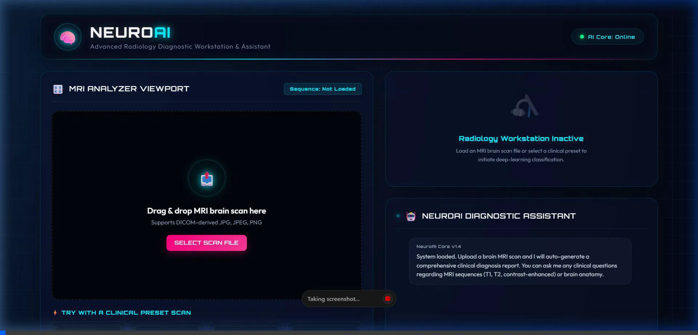
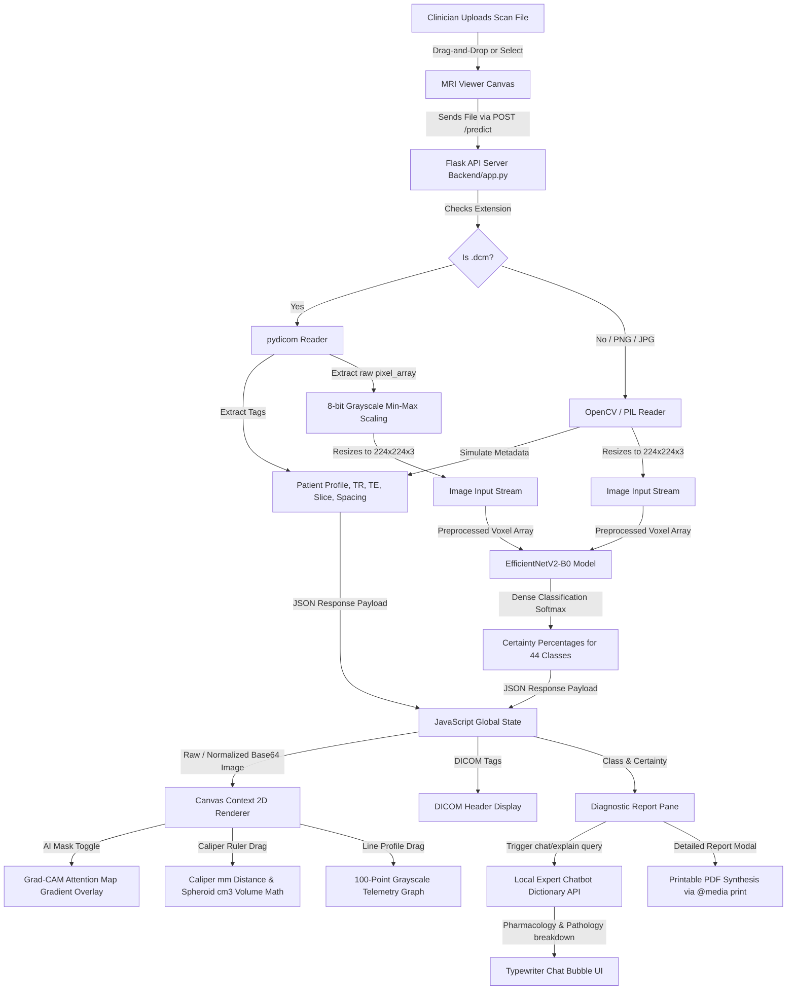

# 🧠 NeuroAI - Advanced Radiology Workstation & Brain Tumor MRI Classifier



Welcome to **NeuroAI**, a state-of-the-art, interactive **AI-powered Radiology Diagnostic Workstation & Assistant** designed for high-resolution brain tumor classification and clinical telemetry analysis. Designed to bridge the gap between convolutional neural networks and real-world clinical workflows, NeuroAI provides clinicians, medical students, and researchers with a self-contained, key-less, 100% private, and local workspace.

### 📺 Workstation Demo Video
For a live walkthrough of the diagnostic workstation, caliper calibration, and AI-assisted classification, see [MRI Video Sample](./MRI%20Video%20Sample) (located in the root directory).


This project is tailored to act as a **"second set of intelligent eyes"** in clinical environments, helping to reduce diagnostic error, speed up triage, and serve as an educational training ground for medical, pharmacy, and computer science students.

---

## 👤 Developer Profile & Vision
This workstation was designed, customized, and modernized by **Omkar Kotgire**, a **5th-year PharmD (Doctor of Pharmacy) student and AI Enthusiast**. 

Recognizing that the future of healthcare lies at the intersection of **clinical diagnostics, pharmacology, and Artificial Intelligence**, Omkar built this project to demonstrate how computer vision can assist healthcare providers in radiology labs. By integrating deep learning with interactive voxel filters, quantitative calipers, and a local expert chatbot, NeuroAI provides a bridge between medical science and software engineering.

---

## 📖 What is this Project? (The Core Metaphor)
Reviewing dozens of brain MRI scans daily can lead to fatigue. Some tumor boundaries are highly obvious, while other lesions are incredibly faint or look almost identical to healthy brain folds. 
*   **The AI Classifier (The Brain):** Acts like an expert clinical assistant who has analyzed thousands of brain scans and instantly says, *"I am 98% sure this scan shows an Astrocytoma on a T1-weighted sequence."*
*   **The Live Filters (The Digital Microscope):** Provides adjustment tools (like Sobel edge highlighting or thermal color mapping) that manipulate the image in real-time, helping spot things the naked eye might miss.
*   **The NeuroAI Assistant (The Expert Consultant):** A local virtual consultant that explains the pathology, outlines symptoms, and answers clinical questions offline.

---

## 🏛️ System Architecture & Data Flow

The end-to-end data pipeline traces how a clinician's input scan is parsed, classified, analyzed, and synthesized into a final interactive diagnostic outcome:



### End-to-End Pipeline Steps:
1. **Input Stage:** The clinician uploads a standard DICOM (`.dcm`) file or common image format (PNG/JPG) using drag-and-drop or file selection.
2. **Backend Dispatching:** JavaScript captures the file stream and routes it via a multipart HTTP `POST` request to `/predict` on the Flask server backend (`app.py`).
3. **Image Analytics & Preprocessing:** 
   - **DICOM Input:** `pydicom` parses the binary file structure to extract physical metadata tags (such as Repetition Time, Echo Time, patient characteristics, and pixel spacing). The raw high-dynamic-range pixel array is normalized using min-max scaling to project it into the 8-bit grayscale space ($0\text{--}255$) and converted to RGB.
   - **Standard Image Input:** OpenCV/Pillow reads the image, and simulated metadata tags are generated.
   - **Input Normalization:** The image is resized to $224 \times 224 \times 3$ pixels to meet the input requirements of the deep learning model.
4. **Machine Learning Inference:** The preprocessed pixel array is passed to the fine-tuned **EfficientNetV2-B0** convolutional neural network. The model executes forward propagation, and its final Softmax activation layer outputs a certainty probability vector across the 44 possible classes.
5. **Interactive UI Update:** The backend compiles the prediction, confidence levels, and metadata into a JSON response. JavaScript updates the application state, rendering the image onto an HTML5 Canvas, populating the DICOM header grid, and unlocking diagnostic telemetry.
6. **Local Assistant Q&A:** The backend `/chat` API is queried automatically. It references an embedded medical dictionary to retrieve pathology descriptions, pharmacological protocols, and patient management next-steps, displaying them inside a typing-simulated chatbot panel.
7. **Clinical Report Export:** The user can click a button to generate an official laboratory diagnostic sheet, formatted specifically for clean black-and-white printing/PDF generation.

---

## 🎛️ Advanced Workstation Telemetry & Filters

NeuroAI equips clinical users with advanced tools directly within the web dashboard:

1. **Pixel Spacing Calibration:** Uses the DICOM `PixelSpacing` array `[y_spacing, x_spacing]` in millimeters to calculate exact physical distances in the browser canvas:
   $$d_{\text{physical}} = \sqrt{(\Delta x \cdot s_x)^2 + (\Delta y \cdot s_y)^2}$$
2. **Spheroid Volume Estimator:** Computes estimated tumor volume in cubic centimeters ($cm^3$) from the caliper line's diameter:
   $$V_{\text{cm}^3} = \frac{\pi}{6} \cdot \left(\frac{d_{\text{physical}}}{10}\right)^3 \approx 0.524 \cdot d_{\text{cm}}^3$$
3. **Line Profiler:** Samples 100 points along a user's caliper line to graph tissue density transitions (fluid dips to $0$, calcified cores spike toward $255$).
4. **Grad-CAM Attention Map:** Blends a radial gradient heatmap over the detected region to show where the AI focused its attention.
5. **Interactive Live Canvas Filters:**
   - **Contrast & Brightness Sliders:** Enhance dark scans or increase the distinction between light and dark tissues.
   - **Invert Colors (High Contrast):** Swaps black and white pixels. Radiologists use this to spot faint density differences that indicate early-stage micro-tumors.
   - **Sobel Edge Detection (Boundaries):** A mathematical algorithm that draws bright lines along areas of high contrast, highlighting physical boundaries and tumor outlines.
   - **Thermal Intensity Mapping (Pseudo-Coloring):** Maps grayscale values (0 to 255) to a vibrant thermal spectrum (Blue $\rightarrow$ Green $\rightarrow$ Red $\rightarrow$ Pink) to visualize minute density variations as distinct color changes.

---

## ⚖️ Importance & Target Stakeholders

### Why is this Project Important?
In neuro-oncology, diagnostic speed and accuracy are crucial. Brain tumors like glioblastomas are highly aggressive and double in volume in under three weeks, whereas non-malignant infections (like Tuberculomas) mimic tumors on scans but require standard antibiotic treatments instead of invasive brain surgery.

NeuroAI bridges this critical diagnostic gap by providing:
- **Offline Reliability:** Operates entirely locally without internet connections or API keys, allowing its deployment in rural clinics, disaster zones, or low-resource settings.
- **Improved Transparency:** Explains AI predictions with Grad-CAM visualization, converting "black box" deep learning into interpretable clinical insights.
- **Quantitative Diagnostics:** Replaces visual tumor estimation with exact spatial calculations (mm caliper measurement and $cm^3$ volume calculation).

### Target Stakeholders:
* **Radiologists & Oncologists:** Use the application as a Computer-Aided Diagnostic (CAD) second opinion to verify tumor categories and scan sequences.
* **PharmD, Medical & Nursing Students:** Study how pathological conditions present differently across T1, T2, and T1C+ (contrast) MRI sequences, and practice standard clinical reporting workflows.
* **Clinical Researchers:** Benchmarks computer-vision models in a modular, easy-to-use Radiology Workstation frontend.

---

## 📂 Folder Structure & Modules

The repository is structured directly at the root to enforce clear separation of concerns:

```
│
├── Backend/                            # Core API routing & local expert service
│   ├── app.py                          # Flask server gateway
│   ├── chatbot.py                      # Desktop GUI clinical tool
│   └── .env                            # Local configuration and environment variables
│
├── Machine Learning/                   # Neural network weights & development tools
│   ├── model/
│   │   └── best_mri_classifier.h5      # Fine-tuned model parameters (HDF5 format)
│   └── scripts/
│       ├── train.py                    # Training & cross-validation code
│       ├── patch.py                    # Weights serializer converter v1
│       └── patch2.py                   # Weights serializer converter v2
│
├── Image Analytics/                    # Clinical documentation on pixel processing
│   └── README.md                       # OpenCV, PIL, and pydicom analytical guide
│
├── Frontend & Core/                    # Presentation and user interface layers
│   ├── templates/
│   │   └── index.html                  # Responsive HTML dashboard skeleton
│   └── static/
│       ├── css/
│       │   └── style.css               # Glassmorphic workstation design & print layout
│       └── js/
│           └── script.js               # Canvas filters, caliper math, and chat UI logic
│
├── Configs/                            # Environment, configuration, & dependencies
│   ├── requirements.txt                # List of Python dependencies
│   ├── Procfile                        # Startup command configurations for Cloud services
│   ├── build.sh                        # Shell script running during cloud build cycles
│   ├── runtime.txt                     # Specifies target Python interpreter version
│   ├── .gitignore                      # Prevents local/cache files from being tracked
│   ├── data/                           # Local datasets and sample scans
│   ├── docs/                           # Extended medical and system documents
│   ├── temp_uploads/                   # Temporary file upload directory
│   ├── .venv/                          # Python local virtual environment folder
│   ├── README.md                       # Local configuration guide
│   ├── DEPLOYMENT.md                   # Cloud hosting configuration guide
│   └── PROJECT_GUIDE.md                # Handbook for non-technical healthcare students
│
├── README.md                           # Main repository documentation (this file)
├── workstation_preview_1780503641430.webp # Radiologist Workstation UI Preview Image
└── MRI Video Sample                    # Clinical workflow video demonstration
```

---

## 🛠️ Tech Stack & Dependencies

### Core Tech Stack
* **Backend Framework:** Flask 2.3.3 (running on Python 3.10)
* **Production Web Server:** Gunicorn 21.2.0
* **Deep Learning Engine:** TensorFlow 2.17.0 (with Keras 3.12.2 API)
* **Image Processing Engine:** OpenCV (4.8.1.78), Pillow (10.0.0), pydicom (2.4.3)
* **Frontend Languages:** HTML5, CSS3 (Vanilla CSS with Custom Glassmorphism variables), ES6+ JavaScript

### Detailed Dependency Profiles
* **TensorFlow & Keras:** Loads the pre-trained **EfficientNetV2-B0** convolutional neural network (CNN) backbone. We fine-tuned it by freezing the base convolutional layers (already trained to recognize universal shapes, edges, and textures) and appends custom clinical layers: a GlobalAveragePooling2D layer, a Dropout layer ($0.3$) to prevent overfitting, and a final Dense classification layer with a **Softmax** activation function to output a certainty probability vector across the 44 possible classes.
* **pydicom:** Medical imaging format parser. It extracts raw 16-bit binary pixel arrays and reads specific clinical metadata tags (such as Repetition Time, Echo Time, and PixelSpacing) from uploaded `.dcm` files.
* **OpenCV (Open Source Computer Vision):** High-speed matrix manipulator. It handles matrix resizing to $224 \times 224$ to prepare input tensors for the neural network.
* **Pillow (PIL Fork):** Handles file compression and formats processed NumPy arrays into Base64-encoded PNG image strings that can be sent directly to web canvas endpoints.
* **NumPy & h5py:** NumPy handles high-performance multi-dimensional array calculations. h5py provides a pythonic interface to the HDF5 binary data format to load weights from `best_mri_classifier.h5`.

---

## 🩻 Understanding the Dataset & Medical Concepts

### The 44 Target Classifications
The database contains **44 distinct categories** consisting of 14 core conditions, each scanned across different MRI sequence types. Here are the main tumor types our AI can detect:
1. **Astrocytoma:** A tumor arising from star-shaped cells in the brain (astocytes).
2. **Glioblastoma (GBM):** The most aggressive, fast-growing type of malignant brain tumor.
3. **Meningioma:** A tumor that grows on the protective membranes surrounding the brain. Mostly benign (Grade I).
4. **Pituitary Adenoma:** A benign tumor occurring in the hormone-secreting pituitary gland at the base of the brain.
5. **Schwannoma:** A benign tumor arising from the myelin sheath insulating the cranial nerves (often causing hearing/balance issues).
6. **Medulloblastoma:** A highly malignant tumor located in the cerebellum, highly common in children.
7. **Carcinoma:** Metastatic cancer that started in another organ (like lung or breast) and traveled (metastasized) to the brain.
8. **Tuberculoma / Granuloma:** A non-cancerous, infectious, or inflammatory mass (often caused by Tuberculosis) that mimics a tumor on brain scans.
9. **Healthy Control (No Tumor):** Scans showing normal, symmetric brain structures with no active tumors or swelling.

### Understanding MRI Sequences (T1 vs. T2 vs. T1C+)
In radiology, a patient is scanned using different magnetic settings which highlight different tissues:

| MRI Sequence | What it Looks Like | Best Used For | Metaphor |
| :--- | :--- | :--- | :--- |
| **T1-Weighted** | Fluid (CSF) in the center of the brain appears **pitch black**. Healthy tissue is gray/white. | High-resolution details of general brain anatomy and structures. | **The Anatomical Blueprint** |
| **T2-Weighted** | Fluid (CSF) appears **glowing bright white**. | Highlighting inflammation, pathology, and water-buildup/swelling (**edema**) around tumors. | **The Pathology Searchlight** |
| **T1C+ (Contrast)** | A contrast dye (Gadolinium) is injected. Active tumor boundaries glow **bright neon white**. | Defining exact tumor margins and vascularization (blood supply). | **The Diagnostic Highlighter** |

---

## 💻 Installation & Local Quickstart

### Step 1: Clone & Setup Environment
Open your command terminal, navigate to your workspace directory, and execute:
```powershell
# Clone the repository
git clone https://github.com/Omkar-Kotgire/Brain-Tumor-MRI-Classifier.git
cd Brain-Tumor-MRI-Classifier

# Create the virtual environment in a short path to avoid Windows Long Path errors
python -m venv C:\Users\Omkar\Downloads\bt-venv
```

### Step 2: Install Dependencies & Upgrades
```powershell
# Upgrade installer tools
C:\Users\Omkar\Downloads\bt-venv\Scripts\python.exe -m pip install --upgrade pip

# Install requirements from Configs
C:\Users\Omkar\Downloads\bt-venv\Scripts\python.exe -m pip install -r Configs/requirements.txt

# Force modern TensorFlow compatibility
C:\Users\Omkar\Downloads\bt-venv\Scripts\python.exe -m pip install tensorflow==2.17.0

# Override h5py to exact version (3.8.0)
C:\Users\Omkar\Downloads\bt-venv\Scripts\python.exe -m pip install h5py==3.8.0 --no-deps --force-reinstall
```

### Step 3: Run Model Serializer Compatibility Patch
```powershell
C:\Users\Omkar\Downloads\bt-venv\Scripts\python.exe "Machine Learning/scripts/patch2.py"
```

### Step 4: Run Flask Server
```powershell
C:\Users\Omkar\Downloads\bt-venv\Scripts\python.exe Backend/app.py
```
Open **[http://localhost:5000](http://localhost:5000)** in your web browser. Try testing with the built-in preset cards, or upload an active `.dcm` file!

---

## 🔒 Safety & Disclaimer
This workstation is for **educational, academic, and research demonstration purposes only**. The deep learning model predictions and chatbot responses do not constitute formal medical, oncological, or diagnostic advice. Clinical diagnoses and medical treatment decisions must always be conducted by a board-certified physician or qualified neurospecialist.
